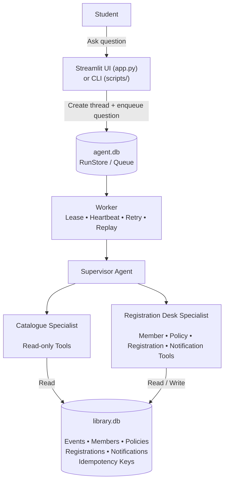

# Architecture

## Main components

| Component | Location | Responsibility |
|---|---|---|
| Streamlit UI | `app.py` | Accepts questions, performs availability checks, and displays booking approval controls |
| CLI interface | `scripts/` | Runs demos, queues questions, and starts workers |
| Agent queue and memory | `app/memory.py`, `schema/agent.sql` | Stores threads, messages, runs, leases, attempts, steps, and tool results |
| Worker | `app/worker.py`, `app/runner.py` | Claims jobs, executes them, renews leases, retries failures, and resumes runs |
| Supervisor | `app/agents.py` | Delegates work to the appropriate specialist |
| Catalogue specialist | `app/agents.py`, `app/tools/library_tools.py` | Provides read-only event and seat information |
| Registration desk specialist | `app/agents.py`, `app/tools/library_tools.py` | Enforces policy, registers students, and records notifications |
| Provider adapters | `app/providers.py` | Supports Groq, Gemini, and scripted mock models |
| Business database | `app/library_db.py`, `schema/library.sql` | Stores event data and enforces capacity, registration, policy, and idempotency rules |

## Database boundary

| Database | Stores | Does not store |
|---|---|---|
| `agent.db` | Conversations, queue jobs, leases, retries, model steps, tool calls | Event capacity or student registration data |
| `library.db` | Members, events, policies, registrations, notifications, idempotency results | Agent conversation history or queue state |